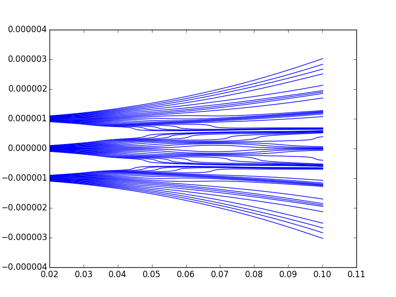
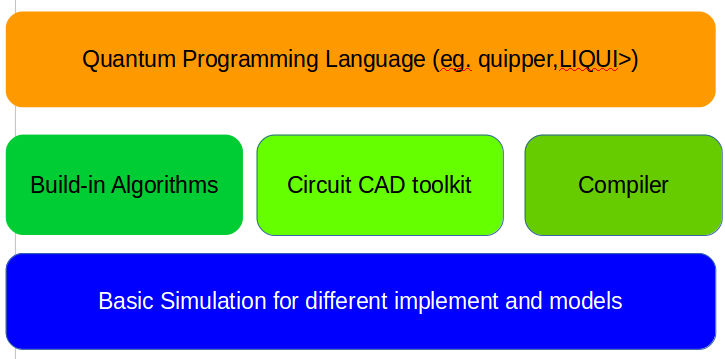

JuliaQuantum is an Julia umbrella organization to build libraries in Julia for quantum science and technology.
The organization aims to provide people advanced high performance libraries in Julia language.


# Why Julia? {#why-julia data-background="#DAA520"}


Julia is a fast dynamic programming language
designed for high performance and its
multiple-dispatch feature.

# {#why-julia data-background="#DAA520"}

I would like to quote a short description from ForwardDiff.jl

---

# {data-background="#DAA520"}

>Unlike many other languages, Julia’s type-based operator overloading is fast and natural, and one of the central design tenets of the langauge. This is because Julia is a dynamic, JIT-compiled language - the compiled bytecode of a Julia function is tied directly to the types with which the function is called, so the compiler can optimize every Julia method for the specific input type at runtime.

---

# {data-background="#DAA520"}
#### For Scientists

High performance is important, however, as the complexity of problems grows rapidly , a programming language designed for high efficiency is also necessary. And we would not like to be cautious of pointers, type declarations and other trifles, we hope we can

# Focus on our problems {data-background="#DAA520"}

---

The language design of Julia makes it much more convenient for scientists in calculating their problems and sharing ideas. eg.
Thanks to the unicode support, you could type equations in a more natural way.

```julia
julia> exp(im*π)
-1
```

---

And as I said, no need for type declarations if you do not want it.

```julia
julia> x=π
π = 3.1415926535897...
```

# Projects in JuliaQuantum

> - QuDynamics.jl
> - QuDirac.jl
> - QuBase.jl
> - QuCmp.jl

---


# Use Julia in quantum science {data-background="#6B8E23"}

# Case 1: AdiaRoll.jl {data-background="#6B8E23"}

This is a simple adiabatic computing simulator in Julia. And it became a part of QuCmp.jl later.

# A brief intro to quantum computing {data-background="#6B8E23"}

---

# {data-background="#6B8E23"}

The world of quantum is usually amazing and strange. One of the most important feature in quantum mechanics is the so-called **entanglement**.


# But what is entanglement? {data-background="#6B8E23"}

In a quantum computer, an example of entanglement is like:

There are two bits $|0\rangle$ and $|0\rangle$, and somehow, they have a kind of connection, so when the first bit changes from $|1\rangle$, the second bit will become $|1\rangle$, too.

---

# {data-background="#6B8E23"}

In quantum machanics, we write it in this way:

$$
|\psi\rangle = \frac{1}{\sqrt{2}}(|0\rangle|0\rangle-|1\rangle |1\rangle)
$$

Here, the square of parameters before the states represents the possibility of each state.
Because this kind of bits is quite different from normal ones, we call them the qubits.

---

# {data-background="#6B8E23"}

However, it could be quite inconvenient to describe them in this way, what if we represent them in matrixes and vectors?

---

# {data-background="#6B8E23"}

and we could represent the state in this way via quantum mechanics:

$$
\begin{pmatrix}
\frac{1}{\sqrt{2}}\\
0\\
0\\
-\frac{1}{\sqrt{2}}\\
\end{pmatrix}
\begin{matrix}
|00\rangle\\
|01\rangle\\
|10\rangle\\
|11\rangle
\end{matrix}
$$


---

# {data-background="#6B8E23"}

#### As qubits is represented by vectors, we could use matrix to describe the operations on qubits, eg. this operation flips the qubits above

$$
\begin{pmatrix}
0 & 0 & 0 & 1\\
0 & 0 & 1 & 0\\
0 & 1 & 0 & 0\\
1 & 0 & 0 & 0
\end{pmatrix}
\cdot
\begin{pmatrix}
\frac{1}{\sqrt{2}}\\
0\\
0\\
-\frac{1}{\sqrt{2}}\\
\end{pmatrix} =
\begin{pmatrix}
-\frac{1}{\sqrt{2}}\\
0\\
0\\
\frac{1}{\sqrt{2}}\\
\end{pmatrix}
$$

---

# {data-background="#6B8E23"}

Furthermore, all the states obeys the Schrödinger equation:

$$
i\frac{d}{dt} |\psi(t)\rangle = H(t) |\psi(t)\rangle
$$

# Adiabatic computing
Adiabatic computing is a quite different way in quantum computing models.
According to the adiabatic theorm, if the evolution is slow enough,the ground state can be kept during the evolution.

---

#
The ground state has the smallest eigen value, as:

$$
H |\text{ground state}\rangle = E_0 |\text{ground state}\rangle
$$

---

#
Therefore, we could encode our questions to qubits' eigen value


# Exact Cover Problem

The Exact Cover problem is about a sequence of clause for n-bits

$$
C_1 \land C_2 \land \dots C_M
$$

---

each clauses involves 3 bits,and the question is what kind of value can these n bits satisfy this sequence of clause?

---

#
First a Hamiltonian can be constructed as following:
$$
H(s) = (1-s)H_B + s\cdot H_P \quad 0\leq s \leq 1
$$

---

#
where,
$$
H_B^{(i)} = \frac{1}{2}(1-\sigma_{x}^{(i)})\quad with\quad \sigma_x^{(i)}=\begin{pmatrix}
0 & 1\\
1 & 0
\end{pmatrix}
$$

$$
H_B = \sum H_{B}^{(i)}
$$

---

#
$$
H_{P,C}(|z_1\rangle |z_2\rangle\cdots |z_n\rangle) = h_C(z_{iC},z_{jC},z_{kC})|z_1\rangle |z_2\rangle\cdots |z_n\rangle
$$

---

# Cost Function
The function $h_C$ is called cost function

for example,

$$
h_C = \begin{cases}
0 \quad \text{if the clause is satisfied}\\
1 \quad \text{if the clause is violated}
\end{cases}
$$

# Back to our Hamiltonian Again

#
take s as t/T,where t is the current time and T is the evolution time.
$$
H = (1-t/T)H_B + t/T \cdot H_P
$$

# At the begining

#
H is actually $H_B$,and the ground state of $H_B$ is designed to Bell state.

# Arrives the final

#
H becomes $H_P$, and we get the ground state of $H_P$, which is the answer to a given problem.Even the problem does not actually have an answer, the algorithm can find the best-match answer.

---

And I developed this package: AdiaRoll.jl, using the Julia language

---

this interface for adiabatic computing is provided as by both Hamiltonian and truth-table for some specific problems.

```julia
using AdiaRoll

eigen,state,p = evolution(
    1e4,
    [TruthTable(0b10010111,[1,2,3]),
    TruthTable(0b10010111,[2,3,4]),
    TruthTable(0b10010111,[3,4,5]),
    TruthTable(0b10010111,[5,6,7]),
    TruthTable(0b10010111,[1,5,6]),
    TruthTable(0b10010111,[2,3,6]),
    ],7)
```

And the evolution function will finish the evolution for computing

---

In QuCmp, the adiabatic parts' APIs is more flexible and easy to use. As the computing process is actually a time-evolution operator.

---

As I introduced in previous slides, there is a lot of matrix operations in this adiabtatic computing. However, with the BLAS support in Julia, matrixes can be used in a much cleaner form with high perfomance.

---

And use PyPlot.jl to plot the result

---


# Case 2: Noodles.jl for Bohmian mechanics

# A brief intro

---

#### Bohmian mechanics

There has been a lot explaination for quantum mechanics, and bohmian mechanics is one of them.

According to quantum mechanics, the state of a particle could be described by a wave function $\phi$, and it do not have such a concept of trajectories. However, in bohmian mechanics, we do have a concept of physical trajectories.

---

After some mathematical calculations, the speed of a particle should be:

$$
V = \frac{\hbar}{m}\frac{\phi^{*}\nabla \phi}{|\phi|^2}
$$

---


In noodles.jl, I offered a solution for drawing particles' trajectories in a velocity field by PyPlot.jl

And the velocity data should be stored in a matrix/tensor whose element should be the velocity at certain grid.

---




---

# On-going project

# QuCmp.jl

#

QuCmp.jl is a framework for simulations for quantum circuits, one-way and adiabatic quantum computing. And furthermore, after the basic framework is done, we would build quantum compiler and circuit CAD toolkit for the open-source community. As I mentioned it is open source. The license is in MIT license.


---

# Structure design




---

# Explanation for each layer

> - **1st layer** provides the other layers the basic simulation environment for quantum computation

---

- **2nd layer** is based on the 1st layer can applies basic operations on a simulated quantum computer
    + **Built-in Algorithms** provides efficient implementation for commonly used algorithms, eg. quantum fourier transformation
    + **Circuit CAD toolkit** provides a user-friendly way to construct quantum circuits and test their outputs
    + **Compiler** ,the most complex part in this layer, provides optimizations for circuits and compile the quantum programming languages to circuit's APIs(instructions) of the 1st layer

---

- **3rd layer** is for quantum programming languages, such as Quipper and LIQUi> or developers can design their own languages and part of the compiler based on the simulated environment provided by 1st and 2nd layer.

---

# Type Structure

---


---

### Design :

```julia
abstract AbstractModels
abstract QuCircuit<:AbstractModels
abstract Adiabatic<:AbstractModels
abstract Oneway <:AbstractModels

abstract AbstractOp{N}
abstract TimeOp{N}<:AbstractOp{N}
abstract Clifford<:AbstractOp{1}
```

---

```julia
type QuBit #or AbstractVector
    state::AbstractVector
    bitnum::Integer

    function QuBit(state::AbstractVector,bitnum::Integer)
        check_state(state) #check if state length meets bitnum
        new(state,bitnum)
    end
end
```

---

```julia
## A graph state is stored by an adjacent matrix
type GraphState<:Oneway
    adjaMatrix::AbstractMatrix
end

## or a group of stabilizer
type stabilizer<:GraphState
    vertexA::Integer
    vertexB::Integer
end
```

---

```julia
immutable Gate{T}<:QuCircuit
    name::AbstractString
    op::T
    bitnum::Integer

    Gate(name::AbstractString,op::T,n::Integer)=new(name,op,n)
end
```

---

```julia
type GateUnit{T}<:QuCircuit
    control_bit::AbstractVector
    realated_bit:AbstractVector
    gate::Gate{T}
    time_layer::Integer
end

typealias Gates AbstractVector{GateUnit}

type Circuit<:QuCircuit
    gates::Gates
    bit_num::Integer
end
```

---

# Prototypes

---

Prototype 1: Simple Quantum Circuits

---

## Construct a circuit
a circuit is constructed by `Circuit`:

you can construct an empty circuit:
```julia
circuit = Circuit()
```

---

to add gates, use the method `addgate!`

the `addgate!` method allows following way to add a quantum gate or a module to a specific place in the circuit.

```julia
# for single qubit gates(like Hadamard)
# circuit : the circuit object
# gate : gate object you want to insert
# id   : the id of the qubit you want to add this gate to
addgate!(circuit,gate,id,time_layer)
```

---

```julia
# for example
# |a> ----[H]----
# |b> -----------
# |c> -----------
# let's add a Hadamard gate to the first qubit in this three-qubit circuit

# first create your circuit
c = Circuit()
addgate!(c,Hadamard,1,1)
```

---

```julia
# for controlled gates
# |a> -----x--------
#          |
# |b> ----[H]-------
# |c> --------------

c_H = Circuit()
addgate!(c_H, 1, Hadamard, 2, 1)
```

---

```julia
# or for multiple input gates(will be useful for other gate-like modules)

# |a> --------x------
#             |
# |b> ------|***|----
#           | M |
# |c> ------|***|----
c_M = Circuit()
addgate!(c_M, 1, M, [2, 3], 1)

# or for multiple controlled gates

# |a> -------x--------
#            |
# |b> -------x--------
#            |
# |c> ------[H]-------
cc_H = Circuit()
addgate!(cc_H, [1,2], Hadamard, 3)
```

---

to measure a circuit, simply use the `measure` method on the circuit you want to measure with the the circuit's input state

```julia
# measure the circuit:
# |a> ----[H]----
# |b> -----------
# |c> -----------
# with input state:
# 1/2*sqrt(2)(|000>+|001>+|010>+...+|111>)

input_state = InitState(3)
circuit = Circuit()
addgate!(circuit, Hadamard, 1, 1)
res_state = measure(circuit,input_state)
```

---

Prototype 2: quantum Fourier Transformation

[wiki](https://en.wikipedia.org/wiki/Quantum_Fourier_transform)

---

[implementation in adiabatic computational model](http://journal.frontiersin.org/article/10.3389/fphy.2014.00044/full)


---

```julia
# Quantum Fourier Transformation
init_state = InitStates(4)# inputs the number of bits

QFT_curcuit = Circuit()

for i=1:4
    addgate!(QFT_circuit,Hadamard,i)
    for j=1:i-1
        addgate!(QFT_circuit,bitID-i,R_k(i),1)
    end
end
```

---

```
res_state = measure(QFT_circuit,init_state)
# suppose this to be the command line(the result is made up)
---
measurement of QFT_circuit:
states| prob
|0000>: 0.0001
|0001>: 0.2000
...
|1111>: 0.2000
---

figure(1)
# For visualization, a circuit should be plotted by
plot(QFT_circuit)
show()
```

---

If you are interested in quantum computing or you are interested in my projects, you could follow me( [@ Roger-luo](http://github.com/Roger-luo) ) on github

---

Thanks!
