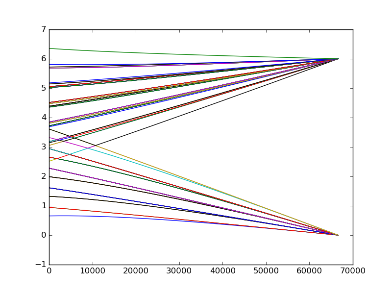

% Kebab
% The Quantum Computation Simulation Framework
% Roger Luo

# What's Kebab?

#

Kebab is a opensource simulation framework for quantum computation written in Julia language.Kebab aims to realize quantum algorithm simulation in different level(eg.hardware level/software level/...) under different computation model and provide useful support for experiments. 

# Why Kebab?

#


#

Cause the framework is based on quantum circuit. All the operations are written into a quantum-gate-like module. And quantum circuit looks like a kebab.

# Why Julia

#
Julia is a fast and effient dynamic language support lots of modern technologies. eg. cothread,distribution computation,cloud computation...

# What can Kebab do?


#

Kebab have serveral functions at present

- qunatum circuit simulation
- basic quantum gates,eg. Hadamard gate,Pauli gates,C-NOT...
- adiabatic quantum computation simulation
- deamo-like cooling module
- quantum fourier transformation

# What's on the to-do list?

#
- quantum error correction
- Shor algorithm
- one-way computation model
- topological quantum computation
- performance optimization
- quantum circuit optimization
- quantum deep learning
- ...

# Some Basic Examples

# First

# Some basic concepts

# Exact Cover Problem
The Exact Cover problem is about a sequence of clause for n-bits

$$
C_1 \land C_2 \land \dots C_M
$$

#

each clauses involves 3 bits,and the question is what kind of value can these n bits satisfy this sequence of clause?

# Adiabatic Computation


# 
First a Hamiltonian can be constructed as following:
$$
H(s) = (1-s)H_B + s\cdot H_P \quad 0\leq s \leq 1
$$

#
where,
$$
H_B^{(i)} = \frac{1}{2}(1-\sigma_{x}^{(i)})\quad with\quad \sigma_x^{(i)}=\begin{pmatrix}
0 & 1\\
1 & 0
\end{pmatrix}
$$

$$
H_B = \sum H_{B}^{(i)}
$$

#
$$
H_{P,C}(|z_1\rangle |z_2\rangle\cdots |z_n\rangle) = h_C(z_{iC},z_{jC},z_{kC})|z_1\rangle |z_2\rangle\cdots |z_n\rangle
$$

# Cost Function
The function $h_C$ is called cost function

#
for example,

$$
h_C = \begin{cases}
0 \quad \text{if the clause is satisfied}\\
1 \quad \text{if the clause is violated}
\end{cases}
$$

whose concept is actually the same with classical search algorithms.

# How does the Adiabatic Computation Work?

#
According to the adiabatic theorm, if the evolution is slow enough,the ground state can be kept during the evolution.

# Back to our Hamiltonian Again

#
take s as t/T,where t is the current time and T is the evolution time.
$$
H = (1-t/T)H_B + t/T \cdot H_P
$$

# At the begining

#
H is actually $H_B$,and the ground state of $H_B$ is designed to Bell state.

# Arrives the final

#
H becomes $H_P$, and we get the ground state of $H_P$, which is the answer to a given problem.Even the problem does not actually have an answer, the algorithm can find the best-match answer.

#
by this APIs offered by Kebab.We can easily simulate how a adiabatic quanutm computer work on a 3-EC problem.

# A 7-bits System

# System Statement

#
```julia
H = AdiaSystem([TruthTable(0b10010111,[1,2,3]),
    TruthTable(0b10010111,[2,3,4]),
    TruthTable(0b10010111,[3,4,5]),
    TruthTable(0b10010111,[5,6,7]),
    TruthTable(0b10010111,[1,5,6]),
    TruthTable(0b10010111,[2,3,6]), 
    ],7,1e3)
```

# Operate the Adiabatic Evolution

#
```
eigens = TimeEvoModule!(state,Hs,1;dt=1e-2)
```

# Plot the Eigen Energy

#


# However

#
There's a big flaw of adiabatic computation model. The eigen energy of Hamiltonian should not cross during the evolution, or the result cannot be garanteed as ground state.

# Here comes the cooling!

#


#
We use the cooling module near places that ground state is close to other eigen values.To help it keep ground state.

#



#
For a time reason, We do not test other condition.

# Quantum Circuit Computation

#
Quantum circuit computation is an important model in quantum computation.

# Let's do this with an example

# Quantum Fourier transformation

#


#
Kebab offers single qubit gates and double qubit control gates.

#
some commonly used gates have already have wrappers,eg.
```julia
#Hadamard gate
function Hadamard(state::AbstractVector,ID::Integer)

#Controled R_k gate
function C_R_k(
    state::AbstractVector,
    CID::Integer,UCID::Integer,
    k::Integer
    )
```

#
we use this two gates to build the quantum circuit of quantum fourier transformation

# For a single qubit

#
```julia
function SingleQubitQFT!(state::AbstractVector,bitID::Integer)
    state_len = length(state)
    bit_num = Int(log2(state_len))

    @assert bitID<=bit_num "bit ID out of bounds"
    
    copy!(state,Hadamard(state,bitID))
    for i=1:(bitID-1)
        copy!(state,C_R_k(state,bitID-i,bitID,i))
    end
    return state
end
```

# For every bit

```julia
function QFT!(state::AbstractVector)
    state_len = length(state)
    bit_num = Int(log2(state_len))

    i = bit_num
    while i>0
        SingleQubitQFT!(state,i)
        i-=1
    end
    return state
end
```

# Kebab is OpenSource!

# Follow [me](https://github.com/Roger-luo/Kebab) on github!

# Just Tell me What you want

# PRs are Welcome!

# Thanks