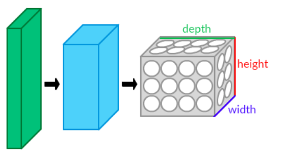

### Advantages

> - DML can learn a similarity metric from image pixels
directly. All layers in DML are optimized by the same
objective function, which are more effective than the
hand-crafted features in traditional methods.
> - The multi-channel filters learned in DML can capture
the   color   and   texture   information   simultaneously,
which  are  more  reasonable  than  the  simple  fusion
strategies in traditional methods,e.g.,feature concate-nation and sum rule.
> - The  structure  of  DML  is  flexible  that  can  easily
switch between view specific and general person re-
identification tasks by whether sharing the parameters
of sub-networks.

#

# CNN

# A brief intro of CNN
In machine learning, a convolutional neural network (CNN, or ConvNet) is a type of feed-forward artificial neural network in which the connectivity pattern between its neurons is inspired by the organization of the animal visual cortex, whose individual neurons are arranged in such a way that they respond to overlapping regions tiling the visual field.

#

# Use CNNs in Video Classification

The CNNs have been established as a powerful class of models for image recognition as a powerful class of models for image-recognition problems. But when we add a time-domain data in the training set like videos. The precision become much lower than images.

# Large-Scale Video Classification by CNNs

This is a CVPR2014 paper by Google and Stanford.

In this paper, researchers explored a pretty large data-set (1 million videos) in four different architectures. And the best architecture improved the precision from
