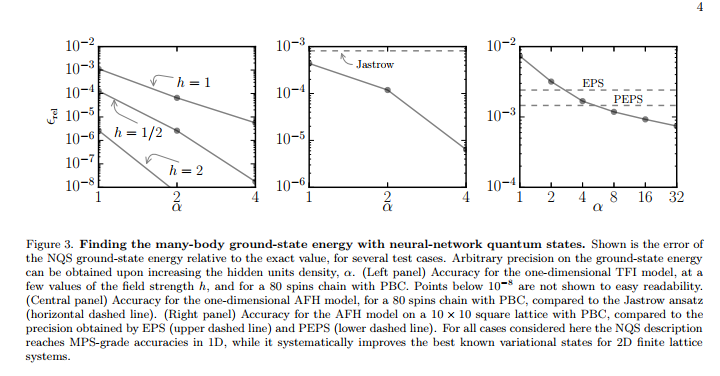
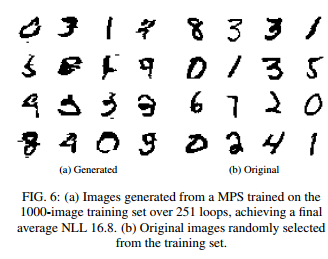

目前机器学习在量子物理中主要有以下应用

> - 作为估计方法应用在和实验相关的领域
> - 用来设计量子线路
> - 辅助调整物理实验参数
> - 凝聚态和多体物理

---

我们主要介绍凝聚态和多体物理中的部分

# 使用神经网络求解量子多体问题

---

Carleo, Giuseppe, and Matthias Troyer. "Solving the quantum many-body problem with artificial neural networks." Science 355.6325 (2017): 602-606.

---

如我们之前所说，神经网络在这里被用作一种量子态的表示形式

---

文章中所展示的效果是非常好的

---

接下来有人分析了其中的纠缠结构和表示能力

---

Deng D L, Li X, Sarma S D. Quantum entanglement in neural network states[J]. Physical Review X, 2017, 7(2): 021021.

---

Gao X, Duan L M. Efficient representation of quantum many-body states with deep neural networks[J]. arXiv preprint arXiv:1701.05039, 2017.

---

我们发现看到这种结构实际上是可以表达不满足面积定律的量子态的。这是神经网络的一个很大的优势。

---

但是这其实还没有结束，原文使用的玻尔兹曼机还仅仅表达很少的一部分量子态，还有一些在张量网络中可以被表达的量子态不能在玻尔兹曼机中表达。

---

此外即便这篇文章称可以使用这种方法尝试更难的费米子问题，但是也还没有工作真正解决了这些问题。

---

之后由于有了一种新的表示一类量子态的方式，原文的作者又用它来从实验观测结果重构一个量子态，也就是进行统计分析

---

Neural-network quantum state tomography for many-body systems, Giacomo Torlai, Guglielmo Mazzola, Juan Carrasquilla, Matthias Troyer, Roger Melko, and Giuseppe Carleo

---

接下来有人将其推广到一种张量网络上去

---

Glasser, Ivan, et al. "Neural Networks Quantum States, String-Bond States and chiral topological states." arXiv preprint arXiv:1710.04045 (2017).

---

实际上这篇文章又回到了张量网络的框架下来，将原先的玻尔兹曼机等价回来了。

---

到这里疑问还非常的多，神经网络是否是一种很好的量子态的表示方法呢？我们还很难知道，但是目前看来最有效的似乎还是张量网络。

---

我猜你们会问：那张量网络能机器学习吗？

---

当然可以

# 用张量网络完成计算机视觉任务

---

Supervised Learning With Quantum-Inspired Tensor Networks，　E. Miles Stoudenmire, and David J. Schwab

---

这篇文章用矩阵乘积态去识别MNIST手写笔记，当然准确率没有CNN高。但是也许这是一种新方法。

---

Unsupervised Generative Modeling Using Matrix Product States, Zhao-Yu Han,
Jun Wang, Heng Fan, Lei Wang,
and Pan Zhang

---

这篇文章则利用矩阵乘积态进行生成学习

---

---

所以张量网络，神经网络，量子物理之间有什么关系呢？这还有待我们未来继续探索！
